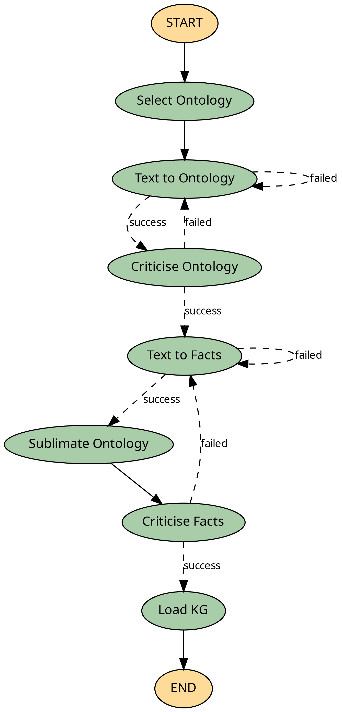

# agentic-onto-triplecast

### Agent graph

<!--  -->
[](graph.png)


## Running the server

```shell
uv run serve --env-path path_openai_key --ontology-path ./data/ontologies --working-directory working_dir
```

## pdf to markdown
```shell
uv run pdfs-to-markdown --input-path data/pdf --output-path data/json [--prefix chem]
```

