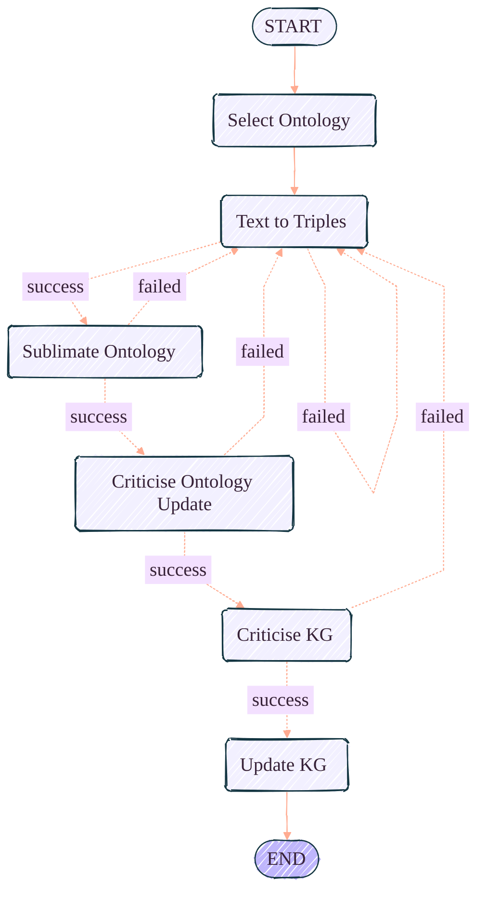

# mcp-ontokg

### Agent graph

```mermaid
---
config:
  flowchart:
    curve: linear
    htmlLabels: true
    useMaxWidth: true
  look: handDrawn
  theme: base
  themeVariables:
    fontFamily: '''Architects Daughter'', cursive'
    fontSize: 20px
    lineColor: '#FFAB91'
    primaryBorderColor: '#143642'
    primaryColor: '#FFF3E0'
    primaryTextColor: '#372237'
---
graph TD;
	START([<p>START</p>]):::first
	Select_Ontology(Select Ontology)
	Text_to_Triples(Text to Triples)
	Sublimate_Ontology(Sublimate Ontology)
	Criticise_Ontology_Update(Criticise Ontology Update)
	Criticise_KG(Criticise KG)
	Update_KG(Update KG)
	END([<p>END</p>]):::last
	Select_Ontology --> Text_to_Triples;
	Update_KG --> END;
	START --> Select_Ontology;
	Text_to_Triples -. &nbsp;success&nbsp; .-> Sublimate_Ontology;
	Sublimate_Ontology -. &nbsp;success&nbsp; .-> Criticise_Ontology_Update;
	Sublimate_Ontology -. &nbsp;failed&nbsp; .-> Text_to_Triples;
	Criticise_Ontology_Update -. &nbsp;success&nbsp; .-> Criticise_KG;
	Criticise_Ontology_Update -. &nbsp;failed&nbsp; .-> Text_to_Triples;
	Criticise_KG -. &nbsp;success&nbsp; .-> Update_KG;
	Criticise_KG -. &nbsp;failed&nbsp; .-> Text_to_Triples;
	Text_to_Triples -. &nbsp;failed&nbsp; .-> Text_to_Triples;
	classDef default fill:#f2f0ff,line-height:1.2
	classDef first fill-opacity:0
	classDef last fill:#bfb6fc

```