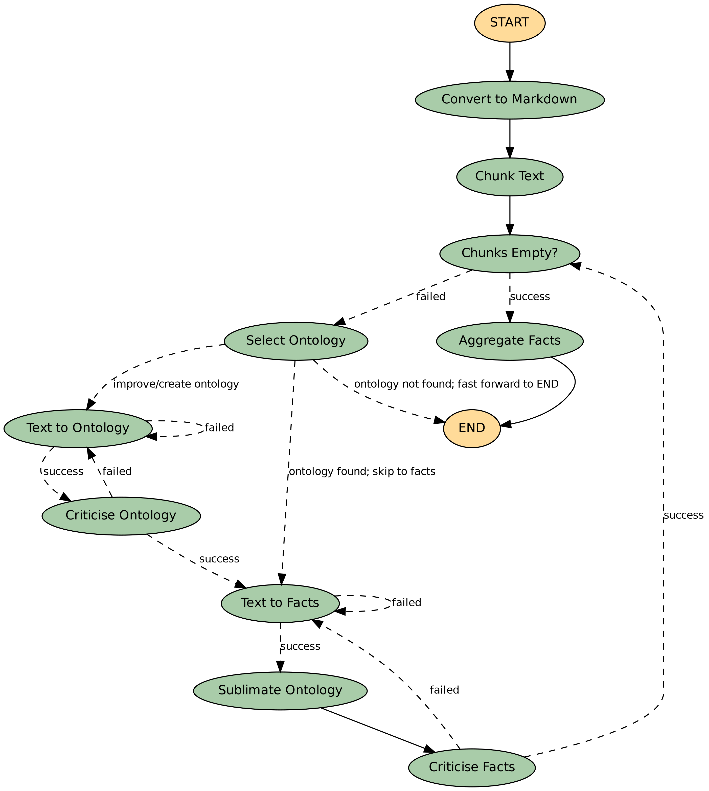

# OntoCast 

### Agentic ontology assisted framework for semantic triple extraction from documents

 
[](https://github.com/growgraph/ontocast/actions/workflows/pre-commit.yml)
[](https://opensource.org/licenses/Apache-2.0)

## Overview

OntoCast is a powerful framework that automatically extracts semantic triples from documents using an agentic approach. It combines ontology management with natural language processing to create structured knowledge from unstructured text.

## Features

- **Automated Ontology Management**
  - Intelligent ontology selection and construction
  - Multi-stage validation and critique system
  - Ontology sublimation and refinement

- **Document Processing**
  - Supports PDF, Markdown, and text documents
  - Automated text chunking and processing
  - Multi-stage validation pipeline

- **Knowledge Graph Integration**
  - RDF-based knowledge graph storage
  - Triple extraction for both ontologies and facts
  - Configurable workflow with visit limits

## Installation

```bash
pip install graphcast
```

## Configuration


Create a `.env` file with your OpenAI API key:

```bash
cp .env.example .env
```

Paste your OPENAI key:
```bash
OPENAI_API_KEY=your_api_key_here
```

### Running the Server

```bash
uv run serve \
    --ontology-directory ./data/ontologies \
    --working-directory working_dir \
    --env-path .env
```

### Processing Documents

1. **Convert PDFs to Markdown** (Optional):
```bash
uv run pdfs-to-markdown \
    --input-path data/pdf \
    --output-path data/json \
    [--prefix chem]
```

2. **Process Documents via API**:
```bash
# Process a PDF file
curl -X POST http://localhost:8999/process \
    -F "file=@path/to/your/document.pdf"

# Process text content
curl -X POST http://localhost:8999/process \
    -H "Content-Type: application/json" \
    -d '{"text": "Your document text here"}'
```

## Project Structure

```
src/
├── agent.py          # Main agent workflow implementation
├── onto.py           # Ontology and RDF graph handling
├── nodes/            # Individual workflow nodes
├── tools/            # Tool implementations
└── prompts/          # LLM prompts
```

## Workflow

The system follows a multi-stage workflow:

1. **Document Preparation**
   - [Optional] Convert to Markdown
   - Text chunking

2. **Ontology Processing**
   - Ontology selection
   - Text to ontology triples
   - Ontology critique
   - Ontology sublimation

3. **Fact Extraction**
   - Text to facts
   - Facts critique
   - Chunk KG aggregation
   - Entity/Propety Disambiguation

4. **Storage**
   - Knowledge graph storage

[](graph.png)

## Documentation

Full documentation is available at: [growgraph.github.io/ontocast](https://growgraph.github.io/ontocast)

## Contributing

Contributions are welcome! Please feel free to submit a Pull Request.

## Acknowledgments

- Built with Python and RDFlib
- Uses OpenAI's language models for semantic analysis
- Based on langchain/langgraph
