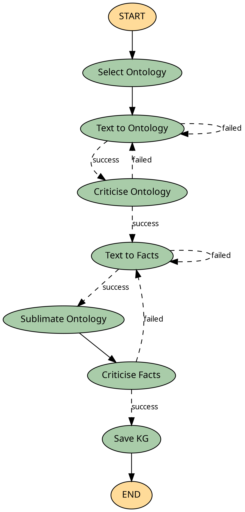

# Agentic Ontology Triplecast 

Agentic ontology assisted framework for semantic triple extraction from text/pdfs.

 
[](https://github.com/growgraph/ontocast/actions/workflows/pre-commit.yml)
[](https://opensource.org/licenses/Apache-2.0)

## Features

- Automated ontology selection and construction
- Text-to-triples conversion for both ontologies and facts
- Multi-stage validation and critique system
- RDF-based knowledge graph storage
- Configurable workflow with visit limits and error handling

## Installation

1. Clone the repository:
```bash
git clone https://github.com/growgraph/ontocast.git
cd ontocast
```

2. Install dependencies using `uv`:
```bash
uv venv
source .venv/bin/activate
uv sync
```

## Configuration


Create a `.env` file with your OpenAI API key:

```bash
cp .env.example .env
```

Paste your OPENAI key:
```bash
OPENAI_API_KEY=your_api_key_here
```

## Usage

### Running the Server

```bash
uv run serve --ontology-directory ./data/ontologies --working-directory working_dir --env-path .env 
```

### Converting PDFs to Markdown

```bash
uv run pdfs-to-markdown --input-path data/pdf --output-path data/json [--prefix chem]
```

## Basic Example

```

```

## Project Structure

```
src/
├── agent.py          # Main agent workflow implementation
├── onto.py           # Ontology and RDF graph handling
├── nodes/            # Individual workflow nodes
├── tools/            # Tool implementations
└── prompts/          # LLM prompts
```

## Workflow

The system follows a multi-stage workflow:

1. Ontology Selection
2. Text to Ontology Triples
3. Ontology Critique
4. Text to Facts
5. Ontology Sublimation
6. Facts Critique
7. Knowledge Graph Storage

## Contributing

Contributions are welcome! Please feel free to submit a Pull Request.

## License

[Your chosen license]

## Acknowledgments

- Built with Python and RDFlib
- Uses OpenAI's language models for semantic analysis

### Agent graph

<!--  -->
[](graph.png)
